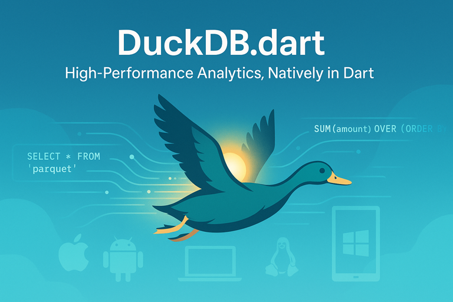

# DuckDB.dart

**Welcome to DuckDB.dart, the native Dart interface to [DuckDB](https://duckdb.org), a high-performance analytical database system.** With DuckDB.dart, you can **harness the power of DuckDB in your Dart applications across multiple platforms**, including Apple (macOS, iOS), Android, Linux, Windows, and Web, delivering seamless integration and top-tier performance for your analytical workloads.



---

## Table of Contents

- [Introduction](#introduction)
- [Why DuckDB.dart?](#why-duckdbdart)
- [Features](#features)
- [Installation](#installation)
- [Getting Started](#getting-started)
  - [Basic Usage](#basic-usage)
  - [Querying Data](#querying-data)
- [Advanced Examples](#advanced-examples)
  - [Querying a Parquet File](#querying-a-parquet-file)
  - [Using Window Functions](#using-window-functions)
  - [Working with CSV Files](#working-with-csv-files)
- [Platform Support](#platform-support)
- [API Documentation](#api-documentation)
- [Contributing](#contributing)
- [License](#license)
- [FAQ](#faq)

---

## Introduction

**DuckDB.dart** is the [Dart](https://dart.dev/) interface to [DuckDB](https://duckdb.org/), an in-process SQL OLAP database management system designed for high-performance analytical queries. Whether you're building mobile apps with Flutter, desktop software, or server-side solutions, DuckDB.dart enables fast, efficient, and versatile data analysis without requiring external database servers.

For an in-depth introduction, watch the DuckCon #5 talk from Seattle 2024: "[Quack attack: Bringing DuckDB to the Dart side](https://www.youtube.com/watch?v=kWM6ZnTHwYk)."

---

## Why DuckDB.dart?

**DuckDB.dart** is an excellent choice for Dart developers needing a powerful embedded database. Here's why:

- **Performance**: Powered by DuckDB's vectorized query engine for lightning-fast analytical queries.
- **Portability**: Runs effortlessly across multiple platforms with no additional setup.
- **Ease of Use**: Provides a simple, Dart-native API that's intuitive for developers.
- **Self-Contained**: Includes DuckDB binaries, eliminating external dependencies.
- **Advanced SQL**: Supports a rich SQL dialect, including window functions and complex queries.

Choose DuckDB.dart for a lightweight, high-performance database solution tailored to Dart.

## Features

- **Native Dart API**: Integrates seamlessly with Dart for a natural developer experience.
- **Cross-Platform Support**: Works on Apple (macOS, iOS), Android, Linux, and Windows.
- **Batteries Included**: Ships with DuckDB binaries—no external installations needed.
- **High-Performance Queries**: Leverages DuckDB's vectorized engine for optimal speed.
- **Nonblocking I/O**: Uses dedicated background isolates per connection for efficient, zero-copy query results.
- **Direct File Access**: Query CSV, JSON, Parquet, and other formats without importing data.
- **Comprehensive SQL Dialect**: Supports advanced [SQL](https://duckdb.org/docs/stable/sql/dialect/friendly_sql) features like window functions and collations.

---

## Installation

DuckDB.dart is available on [pub.dev](https://pub.dev/packages/dart_duckdb). Add it to your project as follows:

### For Flutter Projects

Run this command:

```bash
flutter pub add dart_duckdb
```

This updates your `pubspec.yaml`:

```yaml
dependencies:
  dart_duckdb: ^1.2.0
```

### For Dart Projects

Run this command:

```bash
dart pub add dart_duckdb
```

This updates your `pubspec.yaml`:

```yaml
dependencies:
  dart_duckdb: ^1.2.0
```

Download the latest duckdb release from [duckdb.org](https://github.com/duckdb/duckdb/releases).

In your dart code, tell the framework where the duckdb binary.

```dart
  open.overrideFor(
      OperatingSystem.macOS, 'path/to/libduckdb.dylib');
```

### Import it

Now you can use the package:

```dart
import 'package:dart_duckdb/dart_duckdb.dart';
```

---

## Getting Started

### Basic Usage

Here's a simple example to start using DuckDB.dart:

```dart
Future<void> main() async {
  // flutter builds bundle duckdb binaries, but this can be overriden
  // open.overrideFor(OperatingSystem.macOS, 'path/to/libduckdb.dylib');

  final db = await duckdb.open(":memory:");
  final conn = await duckdb.connect(db);

  await conn.execute("CREATE TABLE users (id INTEGER, name VARCHAR)");
  await conn.execute("INSERT INTO users VALUES (1, 'Alice')");

  final result = await conn.query("SELECT * FROM users");
  for (final row in result.fetchAll()) {
    print(row);
  }

  await conn.dispose();
  await db.dispose();
}
```

This demonstrates opening a database, creating a table, inserting data, querying it, and closing resources.

### Querying Data

Execute SQL queries and process results easily:

```dart
  // ...
  final result = await conn.query("SELECT id, name FROM users WHERE id > 0");
  for (final row in result.fetchAll()) {
    print('ID: ${row[0]}, Name: ${row[1]}');
  }
```

--

## Advanced Examples

### Querying a Parquet File

Query Parquet files directly without loading them into the database:

```dart
  final result = await conn.query(
    "SELECT * FROM 'data/large_dataset.parquet' LIMIT 10",
  );
  for (final row in result.fetchAll()) {
    print(row);
  }
```

### Using Window Functions

Perform advanced analytics with window functions:

```dart
  await conn.execute(
    "CREATE TABLE sales (id INTEGER, amount DECIMAL, date DATE)",
  );
  await conn.execute(
    "INSERT INTO sales VALUES (1, 100.0, '2023-01-01'), (2, 150.0, '2023-01-02'), (3, 200.0, '2023-01-03')",
  );

  final result = await conn.query("""
  SELECT id, amount, date,
         SUM(amount) OVER (ORDER BY date) AS running_total
  FROM sales
""");
  for (final row in result.fetchAll()) {
    print(
      'ID: ${row[0]}, Amount: ${row[1]}, Date: ${row[2]}, Running Total: ${row[3]}',
    );
  }
```

### Working with CSV Files

Query CSV files directly:

```dart
  final result = await conn.query(
    "SELECT * FROM 'data/sales_data.csv' WHERE quantity > 10",
  );
  for (final row in result.fetchAll()) {
    print(row);
  }
```

Explore more examples in the [examples directory](https://github.com/tigereyelabs/duckdb-dart/tree/main/examples).

---

## Platform Support

DuckDB.dart supports the following platforms:

- 🍎 Apple (macOS, iOS)
- 🤖 Android
- 🐧 Linux
- 🪟 Windows
- 🕸️ Web

### Web setup

For Flutter web builds, add the following to `web/index.html` inside the `<head>` to load DuckDB WASM and Apache Arrow:

```html
  <script type="importmap">
    {
      "imports": {
        "apache-arrow": "https://cdn.jsdelivr.net/npm/apache-arrow@17.0.0/+esm"
      }
    }
  </script>
  <script type="module">
    import * as duckdb from "https://cdn.jsdelivr.net/npm/@duckdb/duckdb-wasm@1.29.1-dev222.0/+esm";
    import * as arrow from "apache-arrow";
    window.duckdbWasmReady = new Promise((resolve) => {
      window.duckdbduckdbWasm = duckdb;
      window.ArrowTable = arrow.Table;
      resolve();
    });
  </script>
```

See platform-specific details in the [Building Instructions](BUILDING.md)

---

API Documentation

For detailed API information, visit the [API Documentation](https://pub.dev/documentation/dart_duckdb/latest/).

---

If you have any questions, feedback or ideas, feel free to create an [issue](https://github.com/tigereyelabs/duckdb-dart/issues). If you enjoy this project, I'd appreciate your 🌟 on [GitHub](https://github.com/TigerEyeLabs/duckdb-dart).

---

## FAQ

**Q: Can it handle large datasets?**<br/>
A: Yes, DuckDB excels at processing large datasets efficiently, including direct file queries.

**Q: Is it production-ready?**<br/>
A: Yes, built on the stable DuckDB engine, it's suitable for production use.

**Q: How do I report a bug?**<br/>
A: Open an issue on the GitHub issue tracker.

---

## Sponsors

DuckDB.dart is proudly Sponsored by [TigerEye <span style="font-size: 20px;">🐅</span>](https://www.tigereye.com/)

<p align="center">
<table>
    <tbody>
        <tr>
            <td align="center">
              <a href="https://www.tigereye.com/">
                
              </a>
            </td>
        </tr>
    </tbody>
</table>
</p>

<p align="center">

---

## Contributing

We'd love your contributions! Here's how to get started:

1. Fork the repository.
2. Create a new branch for your feature or bug fix.
3. Make your changes and commit them with descriptive messages.
4. Push your changes to your fork.
5. Submit a pull request with a detailed description of your changes.
